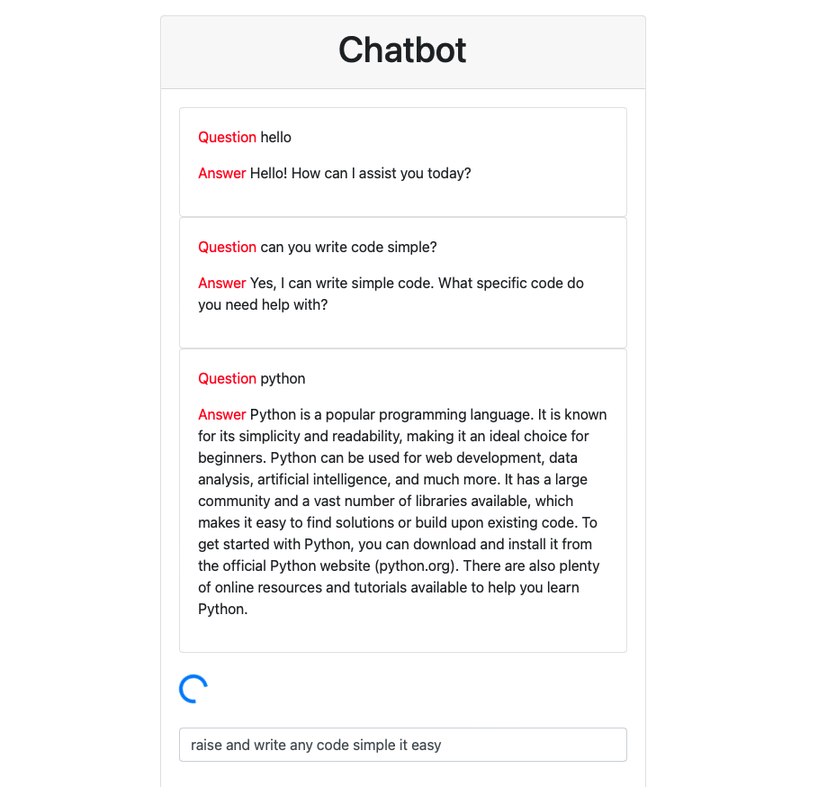

# ChatGPT Web Application

This is a simple web application that uses the GPT-3 language model to generate responses to user input. The application is built using [Python Flask](https://flask.palletsprojects.com/en/2.0.x/) and [OpenAI's GPT-3 API](https://beta.openai.com/docs/api-reference/introduction).

## Installation

To install the application, follow these steps:

1. Clone the repository: `git clone https://github.com/watcharap0n/flask-chatgpt.git`
2. Install the required packages: `pip install -r requirements.txt`
3. Set up your OpenAI API key: [Instructions here](https://beta.openai.com/docs/quickstart)
4. Start the application: `python app.py`

## Example web

## Usage

Once the application is running, you can access it by navigating to `http://localhost:5000` in your web browser. Enter a message in the input field and press "Send" to generate a response from GPT-3.

## Contributing

If you'd like to contribute to the project, feel free to submit a pull request. Please make sure to follow the [contributing guidelines](CONTRIBUTING.md).

## License

This project is licensed under the [MIT License](LICENSE).